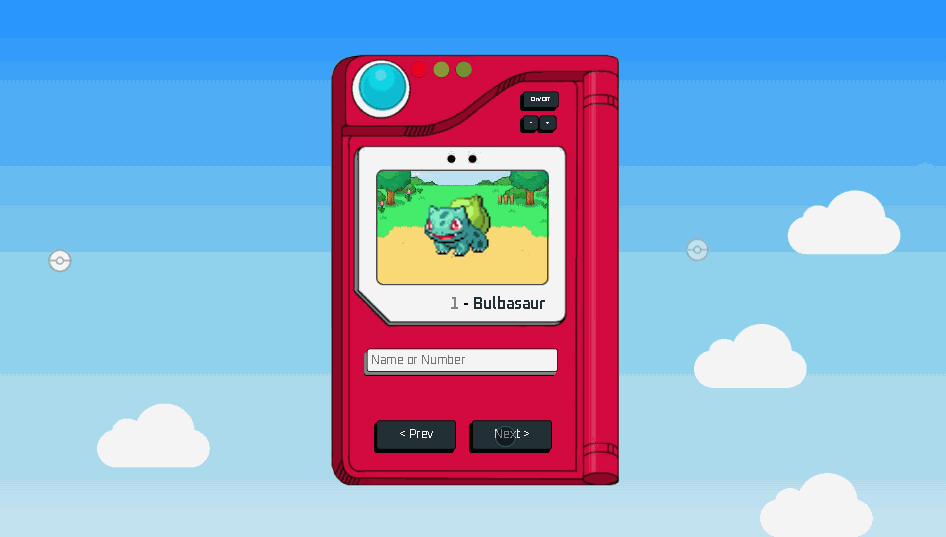

# pokedex
Danilo F. Silva

danilo.ferreira@enesolucoes.com.br

## 📝Descrição
O desafio consiste em criar uma Pokédex utilizando apenas HTML, CSS e JavaScript, ao clicar nos botões de "Prev" ou "Next" será renderizado um novo pokemon na Pokédex.

## 💻Desenvolvimento
O Desafio foi criado utilizando HTML, CSS e JavaScript.

Para a coleta de dados dos Pokémons, foi utilizado a API [PokéAPI](https://pokeapi.co/)

## ✅Execução
O projeto desenvolvido pode ser executado após o download e a execução do [index.html](https://github.com/danfsilva/pokedex/blob/main/index.html)

## 🚀 Resultado final do projeto

